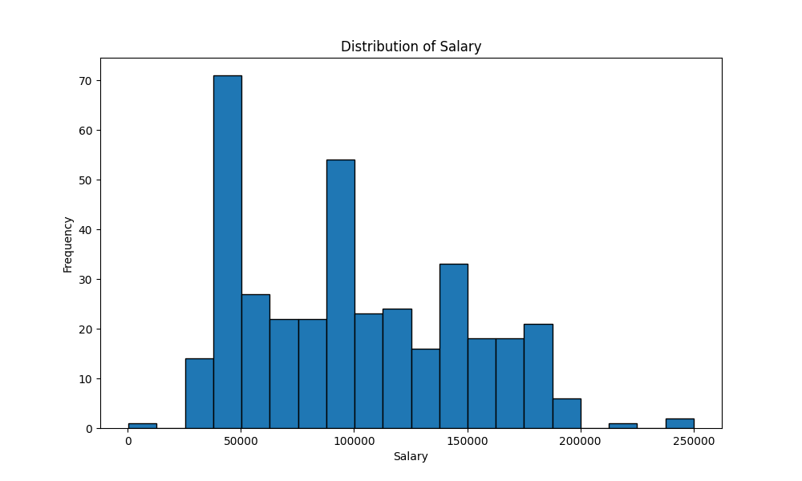

# IDS706 Polars Assignment by Kaisen Yao

This repository contains my work for the **Polars Descriptive Statistics Script** assignment in IDS 706. The script reads a dataset, generates summary statistics, and creates a data visualization. To use it, simply link it to a GitHub codespace and wait for the devcontainer to run the Makefile, which will execute the following tasks: install, format, lint, and test.
Also, it include a comparison betwwen using Pandas and Polars

This repository includes the following main components:

* `.devcontainer`
* `Makefile`
* `requirements.txt`
* `README.md` 
* `githubactions` 
* `Dockerfile`

## Purpose
The purpose of this project is to create a Python script that performs descriptive statistics on a given dataset using Polars. The script:
1. Reads a dataset (CSV).
2. Generates key summary statistics such as mean, median, and standard deviation.
3. Creates a histogram to visualize the distribution of a numerical column.

The project uses `matplotlib` for data visualization and provides a markdown report summarizing the results.

## Preparation
1. Open codespaces.
2. Load repo to codespaces.
3. Wait for the installation of all the requirements in `requirements.txt`.
4. Run the Makefile code: `make all`.

## About the Dataset
This dataset provides details regarding employee salaries within a company. Each row corresponds to an individual employee, with columns capturing various attributes, including age, gender, education, job title, experience, and salary.

**Columns**:
1. Age: The age of the employee, given as a numerical value in years.
2. Gender: The employee’s gender, categorized as male or female.
3. Education Level: Indicates the employee’s highest educational qualification, categorized as high school, bachelor’s degree, master’s degree, or PhD.
4. Job Title: The position held by the employee within the company, with possible titles such as manager, analyst, engineer, or administrator.
5. Years of Experience: The number of years the employee has been working, represented as a numeric value.
6. Salary: The employee’s annual income, listed in US dollars, varying based on job title, experience, and education.

## Outputs

1. **Summary ReportS**: The script computes and outputs important summary statistics rounded to 2 decimal places for numerical columns like `Age`, `Years of Experience`, and `Salary`, comparing using both Pandas and Polars.

   [Summary comparison report](sandbox:/mnt/data/summary_comparison_report.md)
   [Profiler comparison report](sandbox:/mnt/data/profiler_comparison_report.md)

2. **Salary Distribution Visualization**: A histogram showcasing the distribution of salary in the dataset is generated using Polars.

   

## Example Output

Here’s an example of the summary statistics generated by the script:

   

The script provides a clean and concise summary of the dataset's most important numerical fields